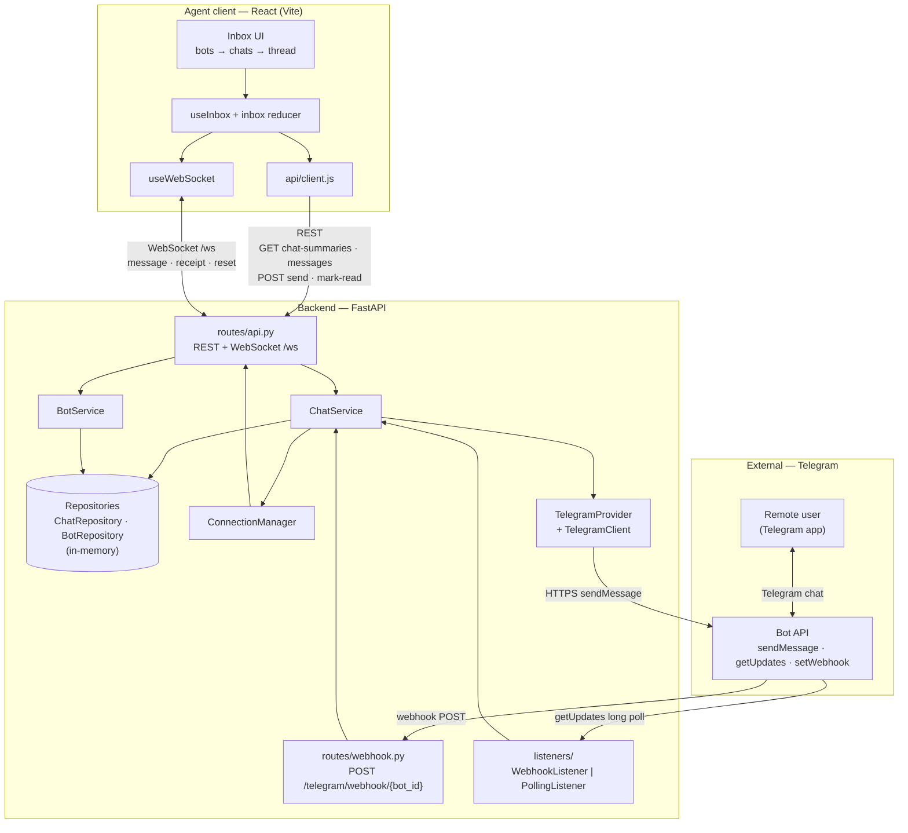
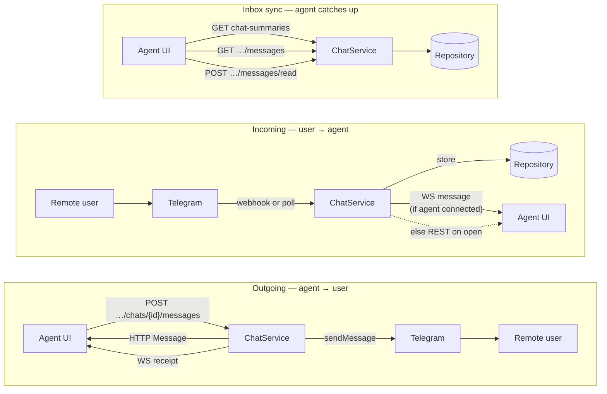

# High-level architecture

Bird's-eye view of the system. For wire protocols and step-by-step flows see
[`integration.md`](./integration.md); for tier detail see [`backend.md`](./backend.md)
and [`frontend.md`](./frontend.md).

## System context

## Message flows

## Layer responsibilities

| Layer | Responsibility |
|---|---|
| **Agent client** | Three-column inbox; optimistic send; live updates over `/ws`; unread from `read_at` |
| **routes/** | Thin HTTP/WS adapters — validate input, map errors, delegate to services |
| **ChatService** | Single orchestrator — send/receive, capacity, store-first incoming, broadcast gate |
| **Repositories** | Per-bot chat/message storage behind async interfaces |
| **TelegramProvider** | Parse incoming updates; deliver outgoing `sendMessage` |
| **Listeners / webhook** | Two ingress paths (poll vs webhook) into the same `ChatService` handler |
| **ConnectionManager** | Tracks connected agents; broadcasts push events on `/ws` |
| **Telegram** | External messaging provider — not owned by this codebase |

## Protocol summary

| Direction | Protocol |
|---|---|
| Agent → backend | REST |
| Backend → agent | WebSocket (`/ws`) |
| Backend → Telegram | HTTPS (`sendMessage`) |
| Telegram → backend | Webhook POST **or** `getUpdates` long poll |
